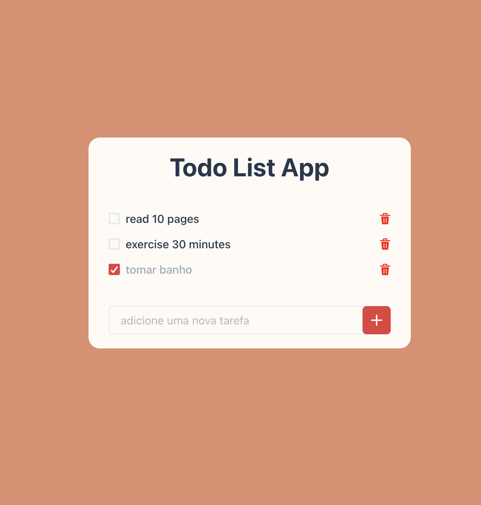

# Todo List

## Deploy

## Descrição do Projeto
Projeto desenvolvido pela dupla Joaquim Chianca e Lucas Agnez na disciplina de Framework com Javascript.

Projeto foi desenvolvido utilizando React com a ChakraUI, uma biblioteca de componentes, que visa aumentar a produtividade de programadores em React. 
